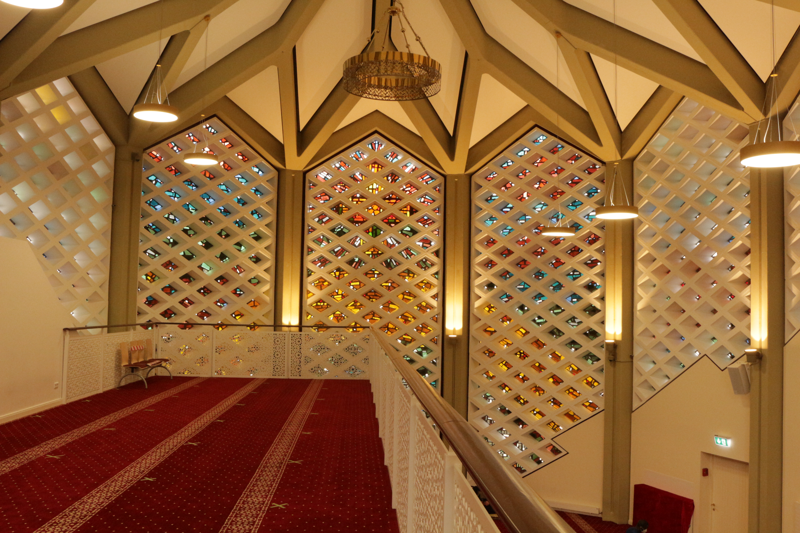
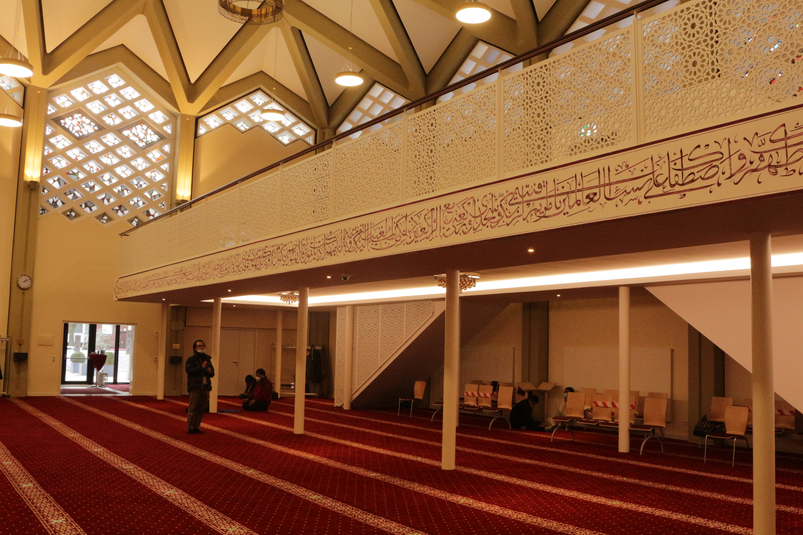
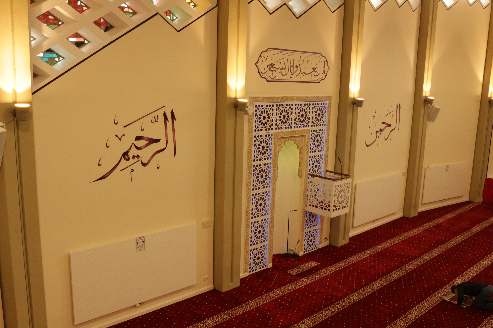
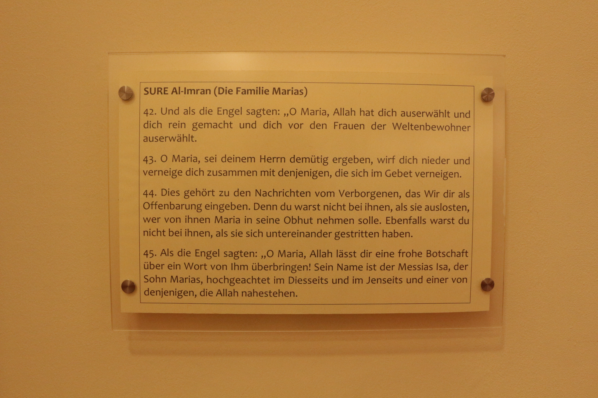

Dieses Projekt beschäftigt sich mit der Transformation von der Kapernaum-Kirche zur Al-Nour Moschee in Hamburg-Horn. Warum aber interreligiös, wenn das Gebäude erst eine Kirche war und jetzt eine Moschee ist? In dem Projekt wird die Hypothese vertreten, dass das Gebäude eine interreligiöse (inter lat.: zwischen) Stätte ist und damit zwischen beiden Religionsgemeinschaften steht. Der Forschungsgegenstand des Projekts ist der Transformationsprozess. Dieser wird nicht in klar voneinander getrennten Zuständen des Gebäudes begriffen, also zuerst dem der Kirche und danach dem der Moschee, sondern als einen interreligiösen Übergangsprozess.

Die Grundlage des Projekts ist dabei der Denkansatz der Critical Heritage Studies. Der Begriff Heritage (engl.: Erbe) soll im Rahmen dieses Projekts als ein materielles Objekt mit historischem oder kulturellem Wert verstanden werden, welches von einer Gemeinschaft weitergegeben oder vererbt wird.[@harrisonUnderstandingPoliticsHeritage2010, S. 10].  Die Methode, die das Vorgehen in diesem Projekt bestimmt, gliedert ein Heritage in vier Kategorien: Stätte, Akteure, Narrative und Ereignisse. Die **Stätte** ist die materielle Repräsentation des Heritages. Daten bezüglich der Stätte werden durch Feldforschung und Archivrecherche in Form von Fotografien erhoben. Die **Akteure** sind der Motor des Heritages. Sie produzieren durch **Narrative** die Bedeutung des Heritages als solches. Dies geschieht, in dem die Akteure in ihren Narrativen **Ereignisse** in einer bestimmten Weise darstellen. Daten hinsichtlich der Akteure, Narrative und Ereignisse werden durch Interviews, Literatur-, und Quellenrecherche erhoben.[@bjorkdahlMemoryPoliticsCultural2017]

Das Ziel des Projekts ist es anhand von diesem Denkansatz und dieser Methode, die Möglichkeit für interreligiöse Perspektiven auf ein geteiltes Heritage zu erforschen. Aus diesen Perspektiven kann das Gebäude dann als Heritage von zwei Religionsgemeinschaften betrachtet werden, auch wenn es aktuell ausschließlich als Moschee genutzt wird. Diese Perspektiven können als Ausgangspunkt für Stärkungen von interreligiöser Interaktion zwischen Christen und Muslimen in Hamburg dienen. Im Folgenden soll der Hintergrund der Transformation vorgestellt und die Hypothese argumentativ gestützt werden

Die ehemalige Kapernaum-Kirche wurde 1961 in der Sievekingsallee 191 gebaut.[3]  Über die Jahre wurde die Gemeinde der Kirche jedoch kleiner, was dann zur Folge hatte, dass die Kirche 2002 abgegeben, entwidmet und 2005 an einen Investor verkauft wurde.[4]  Das Gebäude stand über zehn Jahre leer, als das Islamische Zentrum Al-Nour 2012 das Gebäude über den Investor kaufte.[5] 2013 begannen die Sanierungsarbeiten, die mittlerweile fast abgeschlossen sind. Heute wird das Gebäude von dem Islamischen Zentrum Al-Nour als Moschee genutzt.[6]

[3]:Von Rauch, Andreas. 2001. Gutachten Kapernaumkirche in Horn, Sievekingsallee 191, K432. Aktualisiert 2012 von Stefan Kleineschulte. Hamburger Denkmalschutzamt. 
[4]:Körs, Anna. 2015. Kirchenumnutzungen aus soziologischer Sicht: Wenn eine Kirche zur Moschee wird und weshalb dies ein gesellschaftlicher Gewinn sein kann. In: Kunst und Kirche.  04/2015. Wien: Medecco Holding GmbH. S. 56.
[5]:Ackermann, Michael. 2016. „Eine Kirche wird Moschee“. Hamburg: Landesinstitut für Lehrerbildung und Schulentwicklung. S. 6. 
[6]:Abdin, Daniel. 27.01.2021. Interview über Zoom. 

Das erste Argument stützt sich auf die Interreligiösität im Narrativ der Akteure. Diese Interreligösität wird durch die wechselseitige Akzeptanz der Perspektiven deutlich. Das Hamburger Denkmalschutzamt begreift das Gebäude aufgrund seiner architektonischen Bedeutung immer noch als Kirche. Es wird vom Denkmalschutzamt also weiterhin in seiner Bedeutung als Kirche geschützt. Diese Einordnung stellt für das Islamischen Zentrums Al-Nour jedoch kein Problem dar. Der Vorsitzende des Zentrums Daniel Abdin sagt, dass sie die Kirche nach dem Leitsatz „Außen Kirche, innen Moschee“ erhalten wollen. Sie wollen nicht das Gefühl vermitteln, die Kirche „wegzunehmen“, sondern wollen vielmehr ihren Charakter bewahren.[7]  Pastorin Susanne Juhl, die den letzten Gottesdienst in der Kapernaum-Kirche geleitet hat, stimmt dieser Aussage zu. Sie sagt, dass bei dem Umbau deutlich geworden ist, dass vieles in der Kirche respektvoll und aufwendig restauriert wurde.[8]

[7]:Abdin, Daniel. 27.01.2021. Interview über Zoom.
[8]:Juhl, Susanne. 10.03.2021. Interview über Zoom.

Das zweite Argument beruht auf der Interreligiösität in der Stätte. Denn einige ursprüngliche Elemente wurden entfernt, andere blieben unverändert oder wurden angepasst. Daneben sind neue Elemente dazugekommen. Aus diesem Grund ist es in Bezug auf das Erscheinungsbild des Gebäudes schwierig, die Transformation in zwei voneinander getrennten Zuständen zu verstehen.

Ein prägnantes ehemaliges Element des Gebäudes sind die Dalleglaswände (Abb. 1 und Abb. 2), welche im Kontext der Umwandlung saniert wurden. Für Daniel Abdin gehört diese Fensterwand, die ein zentrales Element der Kirche war, zu dem Charakter des Gebäudes, der trotz der Umnutzung gewahrt werden soll.[9]  Ein anderes wichtiges Element ist der Turm oder das Minarett und das Symbol auf seiner Spitze (Abb. 3 und Abb. 4). Nachdem das Kreuz demontiert und an eine andere Kirche verschenkt wurde, kam auf die Spitze des Minaretts nicht ein Halbmond, sondern der Name Gottes in Arabischen Buchstaben (الله, in Transliteration: Allāh). Dies war eine bewusste Entscheidung des islamischen Zentrum Al-Nour, um die Überzeugung Gott verbinde Christen und Muslime, darzustellen.[10]  Der Glaube an Gott sei also im Laufe der Transformation des Gebäudes der gleiche, nur der Glaubensweg sei ein anderer.[11]  Ein Element, welches im Rahmen der Umnutzung verändert wurde, ist die Empore. Da die Gebetsrichtung der Muslime nach Südosten gerichtet ist, war die ehemalige Empore (Abb. 5) in der Quere. Sie wurde angepasst, so dass ihre Ausrichtung mit der Gebetsrichtung übereinstimmt. Der Intarsienfries, welcher ehemalig die Brüstung der Empore schmückte, wurde an eine andere Kirche verschenkt.[12]  Stattdessen zieren heute kalligraphische Koranverse die Empore (Abb. 6). Neue Elemente sind z. B. das Miḥrāb (arab.: Gebetsnische) (Abb. 7), welche die Gebetsrichtung anzeigt. Neben seiner richtungsweisenden Funktion hat das Miḥrāb auch eine zeremonielle und rituelle Funktion[@petersenDictionaryIslamicArchitecture1999][13], welche es zu einem wichtigen Kennzeichen der Moschee macht. Außerdem hängt in dem Innenraum eine Plakette, welche die Übersetzung von vier Koranversen zeigt, in denen es um Maria geht (Abb. 8). Auch wenn die Figur Maria theologisch zwar zu Differenzen zwischen Christentum und Islam führen kann, ist sie doch ein Symbol der Vermittlung zwischen beiden Religionen.[@pelikanMaryCenturiesHer1996][14] Susanne Juhl sagt, dass durch die Plakette die Bemühung Gemeinsamkeiten zu finden deutlich wird.[15]

[9]:Abdin, Daniel. 27.01.2021. Interview über Zoom.
[10]:Abdin, Daniel. 27.01.2021. Interview über Zoom.
[11]:Juhl, Susanne. 10.03.2021. Interview über Zoom.
[12]:Abdin, Daniel. 27.01.2021. Interview über Zoom.
[15]:Juhl, Susanne. 10.03.2021. Interview über Zoom.

Abschließend lässt sich sagen, dass das Gebäude eine tiefgreifende Veränderung durchgemacht. Diese Veränderungen sind vor dem Hintergrund der Umnutzung durch eine andere Religionsgemeinschaft verständlich. Dennoch wird daneben auch sichtbar, dass Perspektiven von geteiltem Heritage möglich sind.

# Abbildungen

Abbildung 1: Der Innenraum der Kapernaumkirche, ca. 1960. © Archiv der Geschichtswerkstatt Horn

Abbildung 2: Der Innenraum der Al-Nour Moschee mit eingebauter Empore, 2021. © Leon Woltermann
 

Abbildung 3: Der Kirchturm der Kapernaumkirche während des Leerstands, kein Datum. 
© Staatsarchiv Hamburg - Foto: Nicolai Wieckmann 720-1/343-1/D0001875

Abbildung 4: Das Minarett der Al-Nour Moschee, 2021. © Leon Woltermann

Abbildung 5: Die ehemalige Empore mit einem Intarsienfries an der Brüstung im leerstehenden Gebäude der Kapernaumkiche, kein Datum. © Staatsarchiv Hamburg - Foto: Nicolai Wieckmann-720-1/343-1/D0001867

Abbildung 6: Die umgebaute Empore der Al-Nour Moschee mit Kalligrafie von Koranversen, 2021. © Leon Woltermann

Abbildung 7: Miḥrāb oder die Gebetnische der Al-Nour Moschee, welche die Gebetsrichtung nach Mekka anzeigt, 2021. 
© Leon Woltermann

Abbildung 8: Übersetzte Koranverse im Innenraum der Al-Nour Moschee, 2021. © Leon Woltermann

# Verweise
[1] Harrison, Rodney. 2010. Understanding the Politics of Heritage. Manchester: Manchester University Press in
Zusammenarbeit mit der Open University. S. 10. 

[2] Björkdahl, Annika, Susanne Buckley-Zistel, Stefanie Kappler, Johanna Mannergren Selimovic, und Timothy Williams. 2017. „Memory Politics, Cultural Heritage and Peace: Introducing an Analytical Framework to Study Mnemonic Formations”. SSRN Scholarly Paper ID 3206571. Rochester, NY: Social Science Research Network. S. 6-10.

[3] Von Rauch, Andreas. 2001. Gutachten Kapernaumkirche in Horn, Sievekingsallee 191, K432. Aktualisiert 2012 von Stefan Kleineschulte. Hamburger Denkmalschutzamt. 

[4] Körs, Anna. 2015. Kirchenumnutzungen aus soziologischer Sicht: Wenn eine Kirche zur Moschee wird und weshalb dies ein gesellschaftlicher Gewinn sein kann. In: Kunst und Kirche.  04/2015. Wien: Medecco Holding GmbH. S. 56.

[5] Ackermann, Michael. 2016. „Eine Kirche wird Moschee“. Hamburg: Landesinstitut für Lehrerbildung und Schulentwicklung. S. 6. 

[6] Abdin, Daniel. 27.01.2021. Interview über Zoom. 

[7] Abdin, Daniel. 27.01.2021. Interview über Zoom.

[8] Juhl, Susanne. 10.03.2021. Interview über Zoom.

[9] Abdin, Daniel. 27.01.2021. Interview über Zoom.

[10] Abdin, Daniel. 27.01.2021. Interview über Zoom.

[11] Juhl, Susanne. 10.03.2021. Interview über Zoom.

[12] Abdin, Daniel. 27.01.2021. Interview über Zoom.

[13] Petersen, Andrew. 1999. Dictionary of Islamic Architecture. Reprint Edition. London: Routledge. S. 187.

[14] Pelikan, Jaroslav. 1996. Mary through the Centuries: Her Place in the History of Culture. New Haven: Yale University Press. S. 77,78.

[15] Juhl, Susanne. 10.03.2021. Interview über Zoom.

